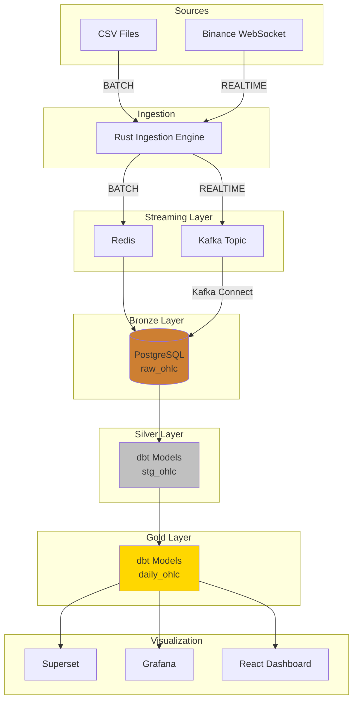

## 🏗️ Architecture

### Data Flow

```mermaid
flowchart TB
    subgraph Sources
        A1[CSV Files]
        A2[Binance WebSocket]
    end

    subgraph Ingestion
        B[Rust Ingestion Engine]
    end

    subgraph "Streaming Layer"
        C1[Redis]
        C2[Kafka Topic]
    end

    subgraph "Bronze Layer"
        D[(PostgreSQL<br/>raw_ohlc)]
    end

    subgraph "Silver Layer"
        E[dbt Models<br/>stg_ohlc]
    end

    subgraph "Gold Layer"
        F[dbt Models<br/>daily_ohlc]
    end

    subgraph Visualization
        G1[Superset]
        G2[Grafana]
        G3[React Dashboard]
    end

    A1 -->|BATCH| B
    A2 -->|REALTIME| B
    B -->|BATCH| C1
    B -->|REALTIME| C2
    C1 --> D
    C2 -->|Kafka Connect| D
    D --> E
    E --> F
    F --> G1
    F --> G2
    F --> G3

    style D fill:#cd7f32
    style E fill:#c0c0c0
    style F fill:#ffd700
```
