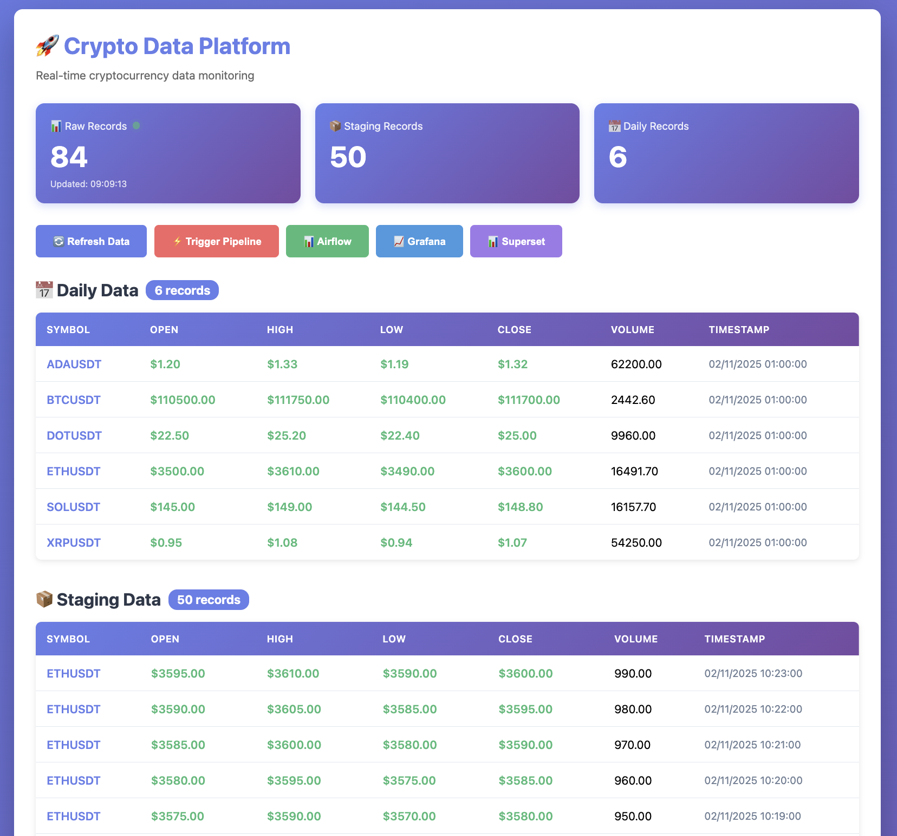

# 🚀 Cookiecutter Data Platform

A production-ready data platform template for crypto market data ingestion, transformation, and visualization.

## ✨ Features

- **Dual-mode ingestion**: Batch (CSV) or Real-time (Kafka + Binance WebSocket)
- **Medallion Architecture**: Bronze (raw) → Silver (cleaned) → Gold (aggregated)
- **Modern Stack**: Rust + Python + Airflow + dbt + Kafka + PostgreSQL
- **Observability**: Prometheus + Grafana monitoring
- **Visualization**: Superset dashboards

### Dashboard Preview


*Real-time cryptocurrency data visualization dashboard*

### Medallion Architecture

- **🥉 Bronze** (`raw_ohlc`): Raw data from CSV or Binance API - unprocessed, as-is
- **🥈 Silver** (`stg_ohlc`): Cleaned and normalized data - validated, deduplicated
- **🥇 Gold** (`daily_ohlc`): Business-level aggregations - ready for analytics and dashboards

## 🚀 Quick Start

### Prerequisites

- Docker & Docker Compose
- Pre-commit (optional but recommended)

### Installation

```bash
# 1. Install pre-commit hooks (recommended)
pip install pre-commit
pre-commit install

# 2. Start services (BATCH mode by default)
docker compose -f {{cookiecutter.project_slug}}/docker-compose-dev.yml up -d

# 3. Access Airflow UI
# URL: http://localhost:8081
# Login: admin / admin

# 4. Enable and trigger the DAG
# Go to Airflow UI → crypto_ingestion_pipeline → Toggle ON → Run
```

## 🔀 Modes

### BATCH Mode (default)
Ingests data from CSV files

```bash
docker compose -f {{cookiecutter.project_slug}}/docker-compose-dev.yml up -d
```

### REALTIME Mode
Streams live data from Binance WebSocket via Kafka

```bash
docker compose -f {{cookiecutter.project_slug}}/docker-compose-dev.yml --profile realtime up -d
```

## 🔒 Pre-commit Hooks

This project uses pre-commit hooks to ensure code quality.

### Setup

```bash
pip install pre-commit
pre-commit install
```

### What it does

- ✅ Formats Python code (ruff)
- ✅ Formats Rust code (cargo fmt)
- ✅ Lints Rust code (cargo clippy)
- ✅ Scans for secrets (gitleaks)
- ✅ Fixes trailing whitespaces

## 📊 Services & Ports

| Service | Port | URL |
|---------|------|-----|
| Airflow | 8081 | http://localhost:8081 |
| PostgreSQL (data) | 5434 | - |
| PostgreSQL (airflow) | 5433 | - |
| Redis | 6379 | - |
| Kafka UI | 8080 | http://localhost:8080 |
| Kafka Connect | 8083 | http://localhost:8083 |
| Superset | 8088 | http://localhost:8088 |
| Prometheus | 9090 | http://localhost:9090 |
| Grafana | 3000 | http://localhost:3000 |

## 🔍 Verification

### Check services are running

```bash
docker ps
```

### Check data in PostgreSQL

```bash
docker exec -it data-platform-postgres psql -U admin -d admin
SELECT COUNT(*) FROM raw_ohlc;
\q
```

### Check Redis

```bash
docker exec -it data-platform-redis redis-cli
KEYS *
exit
```

## 🛑 Stop Services

```bash
# Stop services
docker compose -f {{cookiecutter.project_slug}}/docker-compose-dev.yml down

# Stop and remove volumes (full reset)
docker compose -f {{cookiecutter.project_slug}}/docker-compose-dev.yml down -v
```

## 📚 Documentation

- [COMMANDS.md](./COMMANDS.md) - Complete command reference
- [Architecture diagram](./ARCHITECTURE.md)

## 🐛 Troubleshooting

### DAG doesn't appear in Airflow
Wait 30 seconds for auto-reload or restart:
```bash
docker restart airflow-scheduler airflow-webserver
```

### Kafka Connect errors
Check connector status:
```bash
curl http://localhost:8083/connectors/postgres-sink-crypto/status
```

See [COMMANDS.md](./COMMANDS.md) for detailed troubleshooting commands.

## 🎯 Roadmap

- [x] Batch ingestion (CSV)
- [x] Real-time ingestion (Kafka + WebSocket)
- [x] dbt transformations (Silver/Gold layers)
- [x] Monitoring (Prometheus/Grafana)
- [ ] Superset dashboards
- [ ] CI/CD (GitHub Actions) - In Progress
- [ ] Unit & Integration tests
- [ ] Cloud deployment (Terraform)
- [ ] RAG for chat-based analytics

## 🤝 Contributing

1. Create a branch: `git checkout -b feature/amazing-feature`
2. Make changes (pre-commit will auto-format)
3. Commit: `git commit -m 'Add amazing feature'`
4. Push: `git push origin feature/amazing-feature`
5. Open a Pull Request

## 📝 License

MIT License - see LICENSE file for details
